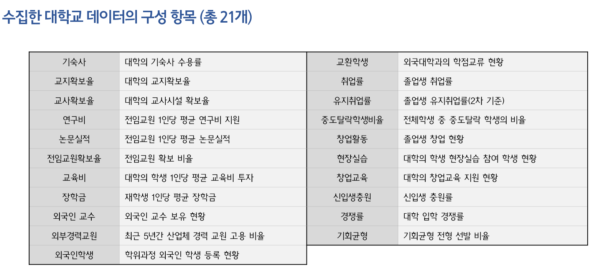
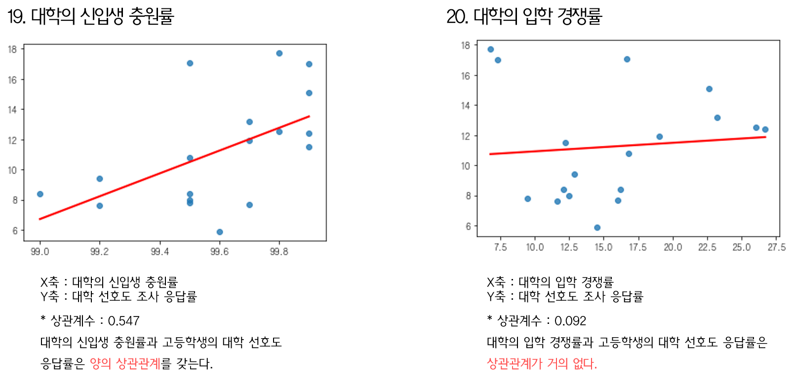
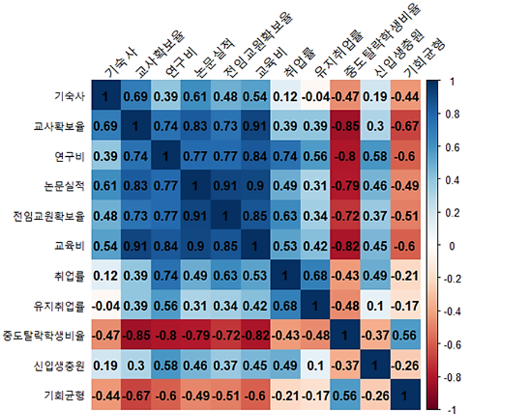
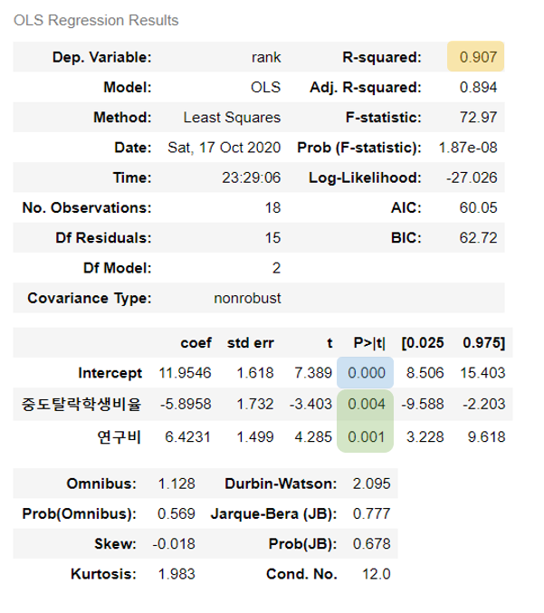
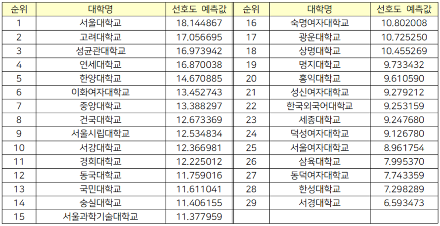

# 고등학생의 대학 선호도 예측 모델

**2020년 2학기 경영과학 중간 프로젝트** (MGT-4061)

## 프로젝트 목표
***"진학 예정자가 지원할 대학을 결정할 때 참고할 수 있는 대학 순위 개발"***
- 대학의 순위를 나열할 수 있는 객관적 지표를 과학적 방법을 통해 설정
- 단, 대학의 범위를 서울소재 4년제 종합대학으로 한정함
- 대학 진학 예정자는 **선호도**를 바탕으로 차등적으로 대학 순위를 매기고 지원한다는 가정을 세움

## 개발내용
### (1) 자료 수집
- 2014년 내일신문 고등학생 대학 선호도 조사 결과 수집
    - 전국 고교생 1,000명을 대상으로 한 대학 선호도 설문조사 결과
    - 2014년 고등학생의 대학 선호도에 미치는 요인은 2020년 현재까지 동일하다고 가정
- [대학알리미](https://www.academyinfo.go.kr/index.do) 사이트에서 2018년 대학 공시 데이터 수집
    - 2014년 대학 선호도 조사 대상에 대응하는 데이터
    - 2014년과 가장 가까우면서 수집 가능한 데이터로 2018년 데이터를 사용
- 위와 마찬가지로 2020년 대학 공시 데이터 수집
    - 2018년도 자료로 모델 학습 뒤 2020년 대학 데이터 입력하여 예측
- 대학 공시 데이터는 총 21개의 항목으로 구성
    - 교사확보율, 취업률 등

<p align="center">
    
</p>

### (2) 상관관계 분석
- 대학의 어떤 요소가 선호도에 영향을 끼치는지 규명하기 위해 상관관계 분석을 실시
- 독립변수는 수집한 대학 데이터 항목, 종속변수는 대학 선호도 조사 응답률로 설정
- 상관관계에 대한 통계적 유의성을 검정하여 불필요한 항목 제거

<p align="center">
    
</p>

### (3) 다중공선성 제거
- 분산팽창요인(VIF)을 계산하고 회귀분석에 사용할 변수 선택

<p align="center">
    
</p>

### (4) 다중회귀분석 수행
- **대학의 전임교원 연구비 지원**, **대학의 중도탈락 학생 비율**의 두 가지 항목을 최종적인 독립변수로 결정
- 다중회귀분석을 실시하고 도출된 회귀식의 유효성 확인
    - 결정계수: 0.907
    - 회귀식 각 항목의 유의확률은 모두 0.005 미만

<p align="center">
    
</p>

### (5) 예측 수행
- 도출된 회귀식을 통해 대학 선호도를 예측하고 2020년의 새로운 대학 순위를 도출
- 2020년 대학 공시 데이터를 회귀식에 대입함

<p align="center">
    
</p>

## 사용법
- ```main.ipynb```에서 순차적으로 셀 실행
